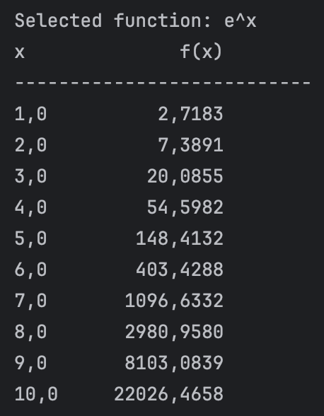
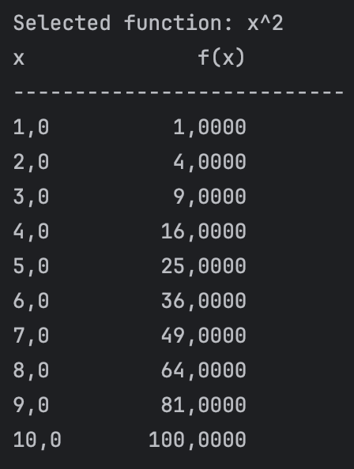

# 📐 Aufgabe 1: Java Function Table Printer

This project implements a small Java application that prints mathematical functions in tabular format. It demonstrates core concepts of **object-oriented programming**, **interfaces**, **lambda expressions**, and **anonymous classes** in Java.

---

## 📌 Objective

Create a program that:
- Defines a general interface for mathematical functions
- Allows the user (or system) to apply different functions to values 1.0 through 10.0
- Randomly selects a function from a predefined list
- Prints a formatted table of `x` and `f(x)` values

---

## 🛠 Technologies Used

- Java 17+
- Interfaces (`IFunction`)
- Static & inner classes
- Anonymous class
- Lambda expression
- `List`, `Random`, `System.out.printf`

---

## 📄 Example Output

Each time the program runs, a random function is selected. It then prints the result of that function applied to values from 1.0 to 10.0.

<p align="center">
  
  
  
  
</p>

## 💡 Key Concepts

| Concept             | Description |
|---------------------|-------------|
| **Interface**        | `IFunction` defines a single method `getVal(double x)` |
| **Modular Design**   | Each function has its own class or implementation |
| **Lambda Use**       | The `e^x` function is implemented using `Math::exp` |
| **Formatted Output** | Output is tabular with aligned decimal values |
| **Random Selection** | A function is chosen randomly from a list at runtime |

---

## 🧪 How to Run

```bash
javac Aufg1.java
java Aufg1
