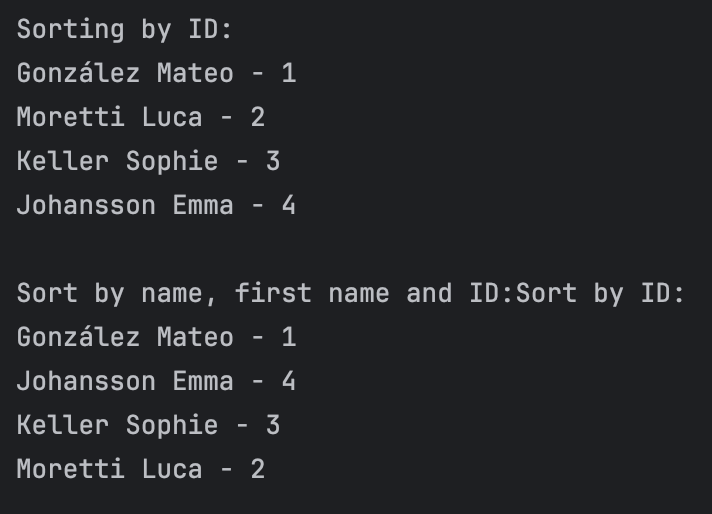

# 🧮 Aufgabe 2: Person Sorting using Java `record`

This small Java program demonstrates how to use Java's modern **`record`** feature alongside **`Arrays.sort()`** and **comparators** to sort an array of `Person` objects.

---

## 📌 Objective

- Define a simple `record` class to represent a `Person` with:
  - `name` (surname)
  - `firstname`
  - `id` (numeric identifier)

- Sort a list of people using different strategies:
  1. By ID (ascending)
  2. By name → firstname → id (lexicographically)

---

## 🔧 Technologies Used

- Java 17+ (`record` support)
- `Arrays.sort()` for sorting
- `Comparator.comparing()` and `thenComparing()` for multi-level sorting

---

## 📄 Sample Output


## 🚀 How to Run

1. Compile the Java file:
   ```bash
   javac Aufg2.java
   java Aufg2
